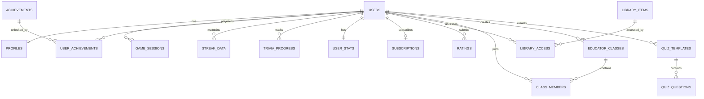

# Database Schema Design

> FinQuest — PostgreSQL Database Schema (via Supabase)

## 1. Overview

This document defines the planned database schema for FinQuest's Supabase PostgreSQL backend. The schema supports user management, gamification progression, game session tracking, content management, and subscription billing.

---

## 2. Entity-Relationship Diagram



---

## 3. Table Definitions

### 3.1 `profiles` — User Profile Data

| Column | Type | Constraints | Description |
|--------|------|-------------|-------------|
| `id` | `uuid` | PK, FK → auth.users.id | Supabase auth user ID |
| `display_name` | `varchar(30)` | NOT NULL | Player display name |
| `avatar_config` | `jsonb` | NOT NULL | react-nice-avatar configuration object |
| `level` | `integer` | NOT NULL, DEFAULT 1 | Current level (1–51+) |
| `rank` | `varchar(30)` | NOT NULL, DEFAULT 'Apprentice' | Rank tier name |
| `role` | `varchar(20)` | NOT NULL, DEFAULT 'student' | 'student' or 'educator' |
| `is_premium` | `boolean` | NOT NULL, DEFAULT false | Premium subscription active |
| `created_at` | `timestamptz` | NOT NULL, DEFAULT now() | Account creation |
| `updated_at` | `timestamptz` | NOT NULL, DEFAULT now() | Last profile update |

**Indexes:** `idx_profiles_display_name`, `idx_profiles_level`

```sql
CREATE TABLE profiles (
    id UUID PRIMARY KEY REFERENCES auth.users(id) ON DELETE CASCADE,
    display_name VARCHAR(30) NOT NULL,
    avatar_config JSONB NOT NULL DEFAULT '{}',
    level INTEGER NOT NULL DEFAULT 1 CHECK (level >= 1),
    rank VARCHAR(30) NOT NULL DEFAULT 'Apprentice',
    role VARCHAR(20) NOT NULL DEFAULT 'student' CHECK (role IN ('student', 'educator')),
    is_premium BOOLEAN NOT NULL DEFAULT FALSE,
    created_at TIMESTAMPTZ NOT NULL DEFAULT NOW(),
    updated_at TIMESTAMPTZ NOT NULL DEFAULT NOW()
);

-- Auto-create profile on user signup
CREATE OR REPLACE FUNCTION handle_new_user()
RETURNS TRIGGER AS $$
BEGIN
    INSERT INTO profiles (id, display_name)
    VALUES (NEW.id, COALESCE(NEW.raw_user_meta_data->>'display_name', 'Player'));
    RETURN NEW;
END;
$$ LANGUAGE plpgsql SECURITY DEFINER;

CREATE TRIGGER on_auth_user_created
    AFTER INSERT ON auth.users
    FOR EACH ROW EXECUTE FUNCTION handle_new_user();
```

---

### 3.2 `user_stats` — XP & Coins Tracking

| Column | Type | Constraints | Description |
|--------|------|-------------|-------------|
| `user_id` | `uuid` | PK, FK → profiles.id | User reference |
| `total_xp` | `bigint` | NOT NULL, DEFAULT 0 | Lifetime XP earned |
| `total_coins` | `bigint` | NOT NULL, DEFAULT 0 | Lifetime coins earned |
| `current_coins` | `bigint` | NOT NULL, DEFAULT 0 | Spendable coins balance |
| `games_played` | `integer` | NOT NULL, DEFAULT 0 | Total game sessions |
| `total_correct` | `integer` | NOT NULL, DEFAULT 0 | Total correct answers |
| `updated_at` | `timestamptz` | NOT NULL, DEFAULT now() | Last stat update |

```sql
CREATE TABLE user_stats (
    user_id UUID PRIMARY KEY REFERENCES profiles(id) ON DELETE CASCADE,
    total_xp BIGINT NOT NULL DEFAULT 0 CHECK (total_xp >= 0),
    total_coins BIGINT NOT NULL DEFAULT 0 CHECK (total_coins >= 0),
    current_coins BIGINT NOT NULL DEFAULT 0 CHECK (current_coins >= 0),
    games_played INTEGER NOT NULL DEFAULT 0 CHECK (games_played >= 0),
    total_correct INTEGER NOT NULL DEFAULT 0 CHECK (total_correct >= 0),
    updated_at TIMESTAMPTZ NOT NULL DEFAULT NOW()
);
```

---

### 3.3 `game_sessions` — Game Play Records

| Column | Type | Constraints | Description |
|--------|------|-------------|-------------|
| `id` | `uuid` | PK, DEFAULT gen_random_uuid() | Session ID |
| `user_id` | `uuid` | FK → profiles.id, NOT NULL | Player |
| `game_mode` | `varchar(30)` | NOT NULL | Game identifier |
| `score` | `integer` | NOT NULL, DEFAULT 0 | Final score |
| `xp_earned` | `integer` | NOT NULL, DEFAULT 0 | XP awarded |
| `coins_earned` | `integer` | NOT NULL, DEFAULT 0 | Coins awarded |
| `duration_seconds` | `integer` | | Time spent playing |
| `questions_answered` | `integer` | | Total questions attempted |
| `correct_answers` | `integer` | | Total correct answers |
| `highest_tier` | `varchar(20)` | | Highest difficulty reached |
| `metadata` | `jsonb` | DEFAULT '{}' | Game-specific extra data |
| `completed_at` | `timestamptz` | NOT NULL, DEFAULT now() | Session end time |

```sql
CREATE TABLE game_sessions (
    id UUID PRIMARY KEY DEFAULT gen_random_uuid(),
    user_id UUID NOT NULL REFERENCES profiles(id) ON DELETE CASCADE,
    game_mode VARCHAR(30) NOT NULL CHECK (game_mode IN (
        'capital-cup', 'monetary-mastery', 'data-diver', 'corporate-climb',
        'speed-round', 'match-up', 'spot-difference'
    )),
    score INTEGER NOT NULL DEFAULT 0,
    xp_earned INTEGER NOT NULL DEFAULT 0,
    coins_earned INTEGER NOT NULL DEFAULT 0,
    duration_seconds INTEGER,
    questions_answered INTEGER,
    correct_answers INTEGER,
    highest_tier VARCHAR(20),
    metadata JSONB DEFAULT '{}',
    completed_at TIMESTAMPTZ NOT NULL DEFAULT NOW()
);

CREATE INDEX idx_game_sessions_user ON game_sessions(user_id);
CREATE INDEX idx_game_sessions_mode ON game_sessions(game_mode);
CREATE INDEX idx_game_sessions_score ON game_sessions(score DESC);
```

---

### 3.4 `streak_data` — Daily Check-in Streaks

| Column | Type | Constraints | Description |
|--------|------|-------------|-------------|
| `user_id` | `uuid` | PK, FK → profiles.id | User reference |
| `current_streak` | `integer` | NOT NULL, DEFAULT 0 | Active streak count |
| `longest_streak` | `integer` | NOT NULL, DEFAULT 0 | All-time best streak |
| `last_check_in` | `date` | | Last check-in date |
| `check_in_history` | `date[]` | DEFAULT '{}' | Array of check-in dates |
| `updated_at` | `timestamptz` | NOT NULL, DEFAULT now() | Last update |

```sql
CREATE TABLE streak_data (
    user_id UUID PRIMARY KEY REFERENCES profiles(id) ON DELETE CASCADE,
    current_streak INTEGER NOT NULL DEFAULT 0,
    longest_streak INTEGER NOT NULL DEFAULT 0,
    last_check_in DATE,
    check_in_history DATE[] DEFAULT '{}',
    updated_at TIMESTAMPTZ NOT NULL DEFAULT NOW()
);
```

---

### 3.5 `achievements` — Achievement Definitions (Reference Table)

| Column | Type | Constraints | Description |
|--------|------|-------------|-------------|
| `id` | `varchar(50)` | PK | Achievement identifier |
| `title` | `varchar(50)` | NOT NULL | Display name |
| `description` | `text` | NOT NULL | What the user did |
| `icon` | `varchar(10)` | NOT NULL | Emoji icon |
| `category` | `varchar(20)` | NOT NULL | gameplay/streak/trivia/social/mastery |
| `requirement` | `varchar(50)` | NOT NULL | Human-readable requirement |
| `xp_reward` | `integer` | NOT NULL, DEFAULT 0 | XP awarded on unlock |
| `coin_reward` | `integer` | NOT NULL, DEFAULT 0 | Coins awarded on unlock |

```sql
CREATE TABLE achievements (
    id VARCHAR(50) PRIMARY KEY,
    title VARCHAR(50) NOT NULL,
    description TEXT NOT NULL,
    icon VARCHAR(10) NOT NULL,
    category VARCHAR(20) NOT NULL CHECK (category IN ('gameplay', 'streak', 'trivia', 'social', 'mastery')),
    requirement VARCHAR(50) NOT NULL,
    xp_reward INTEGER NOT NULL DEFAULT 0,
    coin_reward INTEGER NOT NULL DEFAULT 0
);
```

### 3.6 `user_achievements` — Unlocked Achievements

| Column | Type | Constraints | Description |
|--------|------|-------------|-------------|
| `user_id` | `uuid` | PK, FK → profiles.id | User reference |
| `achievement_id` | `varchar(50)` | PK, FK → achievements.id | Achievement reference |
| `unlocked_at` | `timestamptz` | NOT NULL, DEFAULT now() | When unlocked |

```sql
CREATE TABLE user_achievements (
    user_id UUID NOT NULL REFERENCES profiles(id) ON DELETE CASCADE,
    achievement_id VARCHAR(50) NOT NULL REFERENCES achievements(id),
    unlocked_at TIMESTAMPTZ NOT NULL DEFAULT NOW(),
    PRIMARY KEY (user_id, achievement_id)
);
```

---

### 3.7 `trivia_progress` — Daily Trivia Tracking

| Column | Type | Constraints | Description |
|--------|------|-------------|-------------|
| `user_id` | `uuid` | FK → profiles.id | User reference |
| `trivia_date` | `date` | NOT NULL | Date of trivia set |
| `current_index` | `integer` | NOT NULL, DEFAULT 0 | Current question index |
| `score` | `integer` | NOT NULL, DEFAULT 0 | Correct answers count |
| `completed` | `boolean` | NOT NULL, DEFAULT false | All questions answered |
| PK | | (`user_id`, `trivia_date`) | Composite key |

```sql
CREATE TABLE trivia_progress (
    user_id UUID NOT NULL REFERENCES profiles(id) ON DELETE CASCADE,
    trivia_date DATE NOT NULL,
    current_index INTEGER NOT NULL DEFAULT 0,
    score INTEGER NOT NULL DEFAULT 0,
    completed BOOLEAN NOT NULL DEFAULT FALSE,
    PRIMARY KEY (user_id, trivia_date)
);
```

---

### 3.8 `subscriptions` — Premium Plans

| Column | Type | Constraints | Description |
|--------|------|-------------|-------------|
| `id` | `uuid` | PK, DEFAULT gen_random_uuid() | Subscription ID |
| `user_id` | `uuid` | UQ, FK → profiles.id | Subscriber |
| `plan` | `varchar(30)` | NOT NULL | Plan identifier |
| `billing_cycle` | `varchar(10)` | NOT NULL | 'monthly' or 'annual' |
| `status` | `varchar(20)` | NOT NULL, DEFAULT 'active' | active/cancelled/expired |
| `started_at` | `timestamptz` | NOT NULL, DEFAULT now() | Subscription start |
| `expires_at` | `timestamptz` | NOT NULL | Subscription expiry |
| `payment_ref` | `varchar(100)` | | Payment processor reference |

```sql
CREATE TABLE subscriptions (
    id UUID PRIMARY KEY DEFAULT gen_random_uuid(),
    user_id UUID NOT NULL UNIQUE REFERENCES profiles(id) ON DELETE CASCADE,
    plan VARCHAR(30) NOT NULL CHECK (plan IN ('student-prime', 'educator-prime')),
    billing_cycle VARCHAR(10) NOT NULL CHECK (billing_cycle IN ('monthly', 'annual')),
    status VARCHAR(20) NOT NULL DEFAULT 'active' CHECK (status IN ('active', 'cancelled', 'expired')),
    started_at TIMESTAMPTZ NOT NULL DEFAULT NOW(),
    expires_at TIMESTAMPTZ NOT NULL,
    payment_ref VARCHAR(100)
);
```

---

### 3.9 `library_items` — Content Library

| Column | Type | Constraints | Description |
|--------|------|-------------|-------------|
| `id` | `uuid` | PK, DEFAULT gen_random_uuid() | Content ID |
| `title` | `varchar(100)` | NOT NULL | Content title |
| `author` | `varchar(50)` | NOT NULL | Author name |
| `type` | `varchar(20)` | NOT NULL | module/notes/presentation/video |
| `category` | `varchar(30)` | NOT NULL | Subject category |
| `description` | `text` | | Content description |
| `is_premium` | `boolean` | NOT NULL, DEFAULT false | Premium-only flag |
| `file_path` | `text` | | Supabase Storage path |
| `created_by` | `uuid` | FK → profiles.id | Uploader |
| `created_at` | `timestamptz` | NOT NULL, DEFAULT now() | Upload date |

```sql
CREATE TABLE library_items (
    id UUID PRIMARY KEY DEFAULT gen_random_uuid(),
    title VARCHAR(100) NOT NULL,
    author VARCHAR(50) NOT NULL,
    type VARCHAR(20) NOT NULL CHECK (type IN ('module', 'notes', 'presentation', 'video')),
    category VARCHAR(30) NOT NULL,
    description TEXT,
    is_premium BOOLEAN NOT NULL DEFAULT FALSE,
    file_path TEXT,
    created_by UUID REFERENCES profiles(id),
    created_at TIMESTAMPTZ NOT NULL DEFAULT NOW()
);
```

---

### 3.10 `leaderboard_views` — Materialized Rankings

```sql
-- Materialized view for fast leaderboard queries
CREATE MATERIALIZED VIEW leaderboard_xp AS
SELECT
    p.id AS user_id,
    p.display_name,
    p.level,
    p.rank,
    p.avatar_config,
    us.total_xp,
    ROW_NUMBER() OVER (ORDER BY us.total_xp DESC) AS position
FROM profiles p
JOIN user_stats us ON p.id = us.user_id
ORDER BY us.total_xp DESC
LIMIT 100;

CREATE MATERIALIZED VIEW leaderboard_coins AS
SELECT
    p.id AS user_id,
    p.display_name,
    p.level,
    p.rank,
    p.avatar_config,
    us.total_coins,
    ROW_NUMBER() OVER (ORDER BY us.total_coins DESC) AS position
FROM profiles p
JOIN user_stats us ON p.id = us.user_id
ORDER BY us.total_coins DESC
LIMIT 100;

-- Refresh every hour via cron
-- SELECT cron.schedule('refresh-leaderboards', '0 * * * *', 'REFRESH MATERIALIZED VIEW leaderboard_xp; REFRESH MATERIALIZED VIEW leaderboard_coins;');
```

---

## 4. Row Level Security (RLS) Policies

```sql
-- Enable RLS on all tables
ALTER TABLE profiles ENABLE ROW LEVEL SECURITY;
ALTER TABLE user_stats ENABLE ROW LEVEL SECURITY;
ALTER TABLE game_sessions ENABLE ROW LEVEL SECURITY;
ALTER TABLE streak_data ENABLE ROW LEVEL SECURITY;
ALTER TABLE user_achievements ENABLE ROW LEVEL SECURITY;
ALTER TABLE trivia_progress ENABLE ROW LEVEL SECURITY;
ALTER TABLE subscriptions ENABLE ROW LEVEL SECURITY;

-- Users can read/update their own profile
CREATE POLICY "Users can view own profile" ON profiles FOR SELECT USING (auth.uid() = id);
CREATE POLICY "Users can update own profile" ON profiles FOR UPDATE USING (auth.uid() = id);

-- Users can read/write their own stats
CREATE POLICY "Users can manage own stats" ON user_stats FOR ALL USING (auth.uid() = user_id);

-- Users can insert own game sessions, read all (for leaderboards)
CREATE POLICY "Users can insert own sessions" ON game_sessions FOR INSERT WITH CHECK (auth.uid() = user_id);
CREATE POLICY "Users can read all sessions" ON game_sessions FOR SELECT USING (true);

-- Users can manage own streak data
CREATE POLICY "Users can manage own streaks" ON streak_data FOR ALL USING (auth.uid() = user_id);

-- Users can manage own achievements
CREATE POLICY "Users can manage own achievements" ON user_achievements FOR ALL USING (auth.uid() = user_id);

-- Everyone can read achievements definitions
CREATE POLICY "Anyone can read achievements" ON achievements FOR SELECT USING (true);

-- Library items visible to all, premium content gated at application level
CREATE POLICY "Anyone can read library" ON library_items FOR SELECT USING (true);
```

---

## 5. Database Functions

### Auto-level Calculation

```sql
CREATE OR REPLACE FUNCTION calculate_rank(user_level INTEGER)
RETURNS VARCHAR AS $$
BEGIN
    RETURN CASE
        WHEN user_level >= 51 THEN 'FinQuest Grandmaster'
        WHEN user_level >= 41 THEN 'Capital Tycoon'
        WHEN user_level >= 31 THEN 'Investor'
        WHEN user_level >= 21 THEN 'Strategist'
        WHEN user_level >= 11 THEN 'Analyst'
        ELSE 'Apprentice'
    END;
END;
$$ LANGUAGE plpgsql IMMUTABLE;

-- Auto-update rank when level changes
CREATE OR REPLACE FUNCTION update_rank_on_level_change()
RETURNS TRIGGER AS $$
BEGIN
    NEW.rank = calculate_rank(NEW.level);
    NEW.updated_at = NOW();
    RETURN NEW;
END;
$$ LANGUAGE plpgsql;

CREATE TRIGGER trigger_rank_update
    BEFORE UPDATE OF level ON profiles
    FOR EACH ROW EXECUTE FUNCTION update_rank_on_level_change();
```

---

*Last updated: March 2026*
